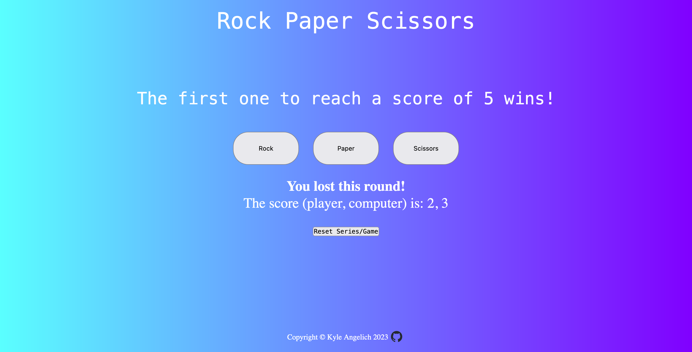

# odin-rock-paper-scissors

This is my first project utilizing JavaScript.  This was completed as part of The Odin Project.

## Overview

### The challenge

Users should be able to:

- Play a game of rock, paper, scissors (first to a score of 5).
- Reset the game.
- View the score, the winner of each round, and the winner of the series/game.

Through my completion of this project I gained experience with the DOM and JavaScript basics such as arrays, functions, event listeners, conditional statements, switch statements, and more!

This project began by developing the basic logic to play a game of rock, paper, scissors (RPS) against the "computer".  Through the utilization of the DOM, I was able to construct a basic GUI that allows one to play a game of RPS without having to utilize the window.prompt() method and developer console.

### Screenshot

### Links

- Live Site URL: [Rock, Paper, Scissors - live link](https://kylea99.github.io/odin-rock-paper-scissors/)

### Built with

- Semantic HTML5 markup
- CSS custom properties
- Flexbox
- JavaScript
- DOM